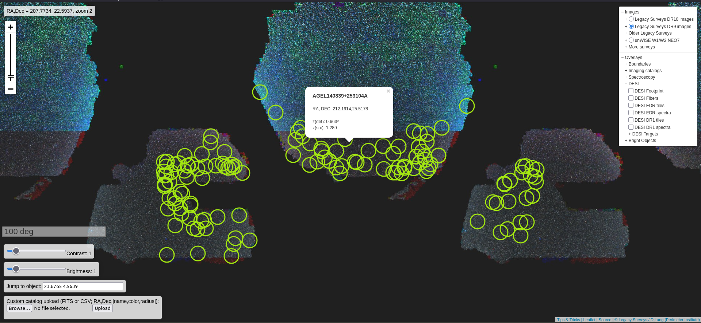
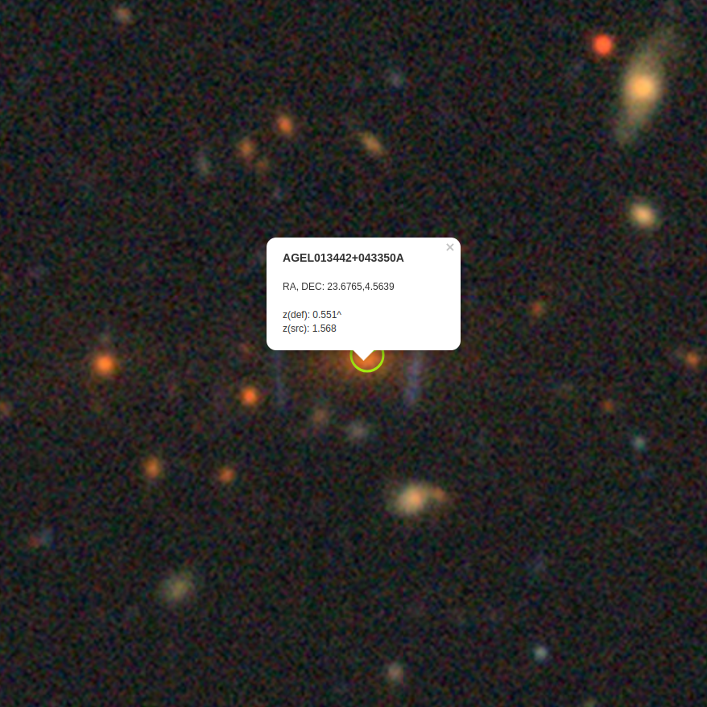
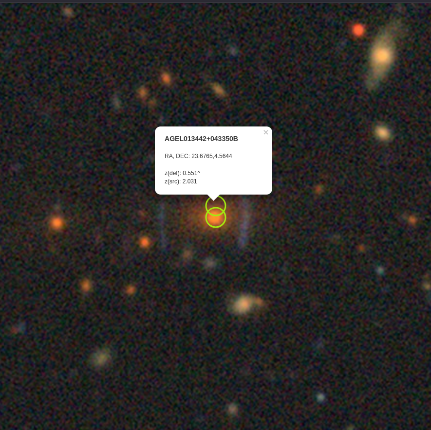

# AGEL survey plugin for the legacysurvey-viewer

This browser extension overlays the location and measured redshifts of gravitational lenses from the [AGEL survey](https://sites.google.com/view/agelsurvey/home?authuser=0)-- [Data Release 2](https://arxiv.org/abs/2503.08041) on the LegacySurvey-viewer

Download the extension for firefox [here](https://addons.mozilla.org/en-US/firefox/addon/agel-plugin-for-legacysurvey/) and chrome (coming soon).

### Demo 

Navigate to the [LegacySurvey-viewer](https://www.legacysurvey.org/viewer) and all the AGEL survey lenses will be marked in green.

Clicking on any given circle will show the AGEL ID along with the measured source and deflector redshifts. 
If there are lenses with multiple arcs, they are denoted by a separate circle. For example, AGEL013442+043350A and AGEL013442+043350B.

